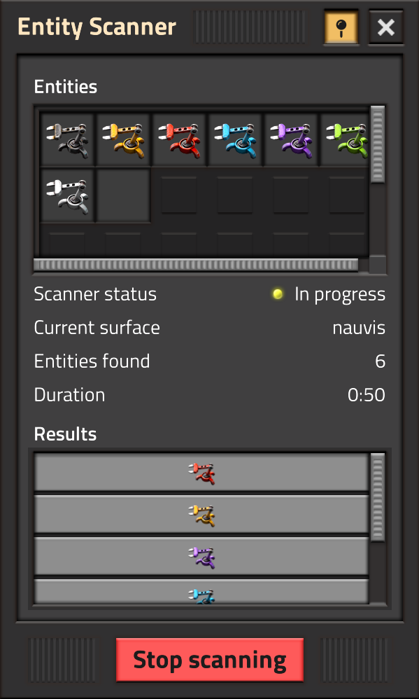

# Factorio entity scanner

A small mod that finds specific entities in your world. It's currently quite raw, but functional.

Multiplayer-friendly (does not freeze the game), but might introduce lag spikes while scanning.

GUI is also not polished at this point.

## Installation

[Download on the Mod Portal.](https://mods.factorio.com/mod/the418_entity_scanner)
